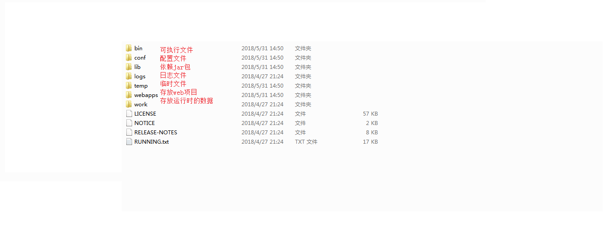

# WEB

## WEB相关概念

1. 软件架构
   - C/S
   - B/S
   
2. 资源分类
   
   
   
   - 静态资源
   - 动态资源（动态资源先转化成静态资源再返回给浏览器）
   
3. 网络通信三要素
   - IP
   - 端口
   - 传输协议

## WEB服务器软件

* 服务器：安装了服务器软件的计算机

* 服务器软件：接收用户的请求，处理请求，做出响应

* web服务器软件：接收用户的请求，处理请求，做出响应
	* 在web服务器软件中，可以部署web项目，让用户通过浏览器来访问这些项目
	* web容器
	
* 常见的java相关的web服务器软件：

  * webLogic：oracle公司，大型的JavaEE服务器，支持所有的JavaEE规范，收费的

  * webSphere：IBM公司，大型的JavaEE服务器，支持所有的JavaEE规范，收费的

  * JBOSS：JBOSS公司的，大型的JavaEE服务器，支持所有的JavaEE规范，收费的

  * Tomcat：Apache基金组织，中小型的JavaEE服务器，仅仅支持少量的JavaEE规范servlet/jsp。开源的，免费的

- JavaEE：Java语言在企业级开发中使用的技术规范的总和，一共规定了13项大的规范

- Tomcat：web服务器软件

  1. 下载：http://tomcat.apache.org/

  2. 安装：解压压缩包即可（安装目录建议不要有中文和空格）

  3. 卸载：删除目录

  4. 启动

     1. bin/startup.bat ,双击运行该文件即可

     2. 访问：浏览器输入：http://localhost:8080 回车访问自己； http://别人的ip:8080 访问别人

        > 可能会遇到的问题：
        >
        > 1. 黑窗口一闪而过：
        >    * 原因： 没有正确配置JAVA_HOME环境变量
        >    * 解决方案：正确配置JAVA_HOME环境变量
        >    
        > 2. 启动报错：（查看日志）端口占用
        >
        >    1. 暴力：找到占用的端口号，并且找到对应的进程，杀死该进程（管理员运行CMD)
        >
        >       ```java
        >       netstat -ano|findstr 8080  //查看8080端口占用进程
        >       taskkill -pid 刚才查到的pid -f  //不加f会通知OS结束线程，加f强制结束
        >       ```
        >
        >    2. 温柔：修改自身端口号（不推荐使用）
        >
        >       - 打开tomcat安装目录下的配置文件：conf/server.xml
        >
        >       - 设置
        >
        >         ```xml
        >         <Connector port="8080" protocol="HTTP/1.1"
        >         		               connectionTimeout="20000"
        >         		               redirectPort="8445" />
        >         ```
        >
        >       - 一般会将tomcat的默认端口号修改为80端口，80端口是HTTP协议默认端口。好处就是，在访问时可以不用输入端口号即可访问

  5. 关闭

     1. 正常关闭
        - bin/shutdown.bat
        - ctrl+c
     2. 强制关闭
        - 直接关闭tomcat窗口

  6. 配置（介绍三种在tomcat下部署项目的方式）

     1. 直接将项目放到webapps目录下

        - /hello :项目的访问路径-->虚拟目录
        - 这种方式可以简化一下：将整个项目打包成一个war包，再将war包放置在webapps目录下。（war包将会自动解压缩，同时删除war包，解压缩的文件夹自动会删除）

     2. 配置conf/server.xml文件（配置错误有可能影响其他的程序，不推荐使用）

        在<host>标签体中配置：

        ```xml
        <Context docBase="D:\hello" path="/hehe" />
        //其中
        docBase：项目存放的路径
        path:虚拟目录
        ```

     3. 在conf\Catalina\localhost创建任意名称的xml文件

        在新建的xml文件中写配置：

        ```xml
        <Context docBase="D:\hello" />
        虚拟目录的名称时：xml文件的名称
        ```

- 动态项目的目录结构（对比静态项目的目录结构）

  - 项目根目录
    
    
    
    - WEB-INF目录
      - web.xml :web 项目的核心配置文件
      - classes目录：放置字节码文件的目录
      - lib目录：放置依赖jar包

## IDEA中继承tomcat，创建JavaEE项目，部署项目

> 问题及解决方案：
>
> 1. tomcat log 中文乱码问题；
>
>    - 调整tomcat安装目录下conf/logging.properties中所有encoding为UTF-8
>
>    - IDEA中设置所有编码为UTF-8；help-->Edit Custom VM options，添加：
>
>      `-Dfile.encoding=UTF-8`
>
> 2. Tomcat设置
>
>    - run-->Confriguations-->server-->"Update resources"
>
>      ​											-->Deployment-->Application context:/ 设置虚拟目录
>    
> 3. IDEA会为每一个tomcat部署的项目单独建立一份配置文件，具体配置文件的位置可以通过查看控制台中log获取:
>
>    ​	`Using CATALINA_BASE:   "C:\Users\18395\AppData\Local\JetBrains\IntelliJIdea2020.1\tomcat\Tomcat_8_5_58_JavaWeb"`
>
> 4. 需要区分工作空间目录 和  tomcat部署的web项目 目录
>
>    - tomcat真正访问的是“tomcat部署的web项目”，"tomcat部署的web项目"对应着"工作空间项目" 的web目录下的所有资源
>    - WEB-INF目录下的资源不能被浏览器直接访问
>
> 5. 断点调试

## Servlet入门

- 概念：运行在服务器端的小程序
  - Servlet是一个接口，定义了Java类被浏览器访问到（被tomcat识别）的规则；
  
  - 定义一个类，实现Servlet接口，复写其中的方法；
  
    

### Servlet快速入门

1. 创建javaEE项目；

2. 定义一个Java类实现Servlet接口

   ```java
   public class ServletDemo01 implements Servlet{}
   ```

3. 实现接口中的抽象方法

4. 配置Servlet（使用web.xml文件中配置Servlet）

   ```xml
       <!--配置Servlet-->
       <servlet>
           <servlet-name>demo01</servlet-name>
           <!--配置全类名-->
           <servlet-class>Servlet.ServletDemo1</servlet-class>
       </servlet>
   
   	<!--映射-->
       <servlet-mapping>
           <servlet-name>demo01</servlet-name>
           <!--可以重复-->
           <url-pattern>/demo01</url-pattern>
           <url-pattern>/demo111</url-pattern>
       </servlet-mapping>
   ```

   - 执行原理

     

     1. 当服务器接收到客户端浏览器的请求之后，会解析URL路径，获取访问的Servlet的资源路径；
     2. 查找web.xml文件，检索是否具有对应的<url-pattern>标签体内容；若存在，则找到对应的<servlet-class>的全类名；
     3. tomcat将字节码文件加载至内存，并创建对象；
     4. 调用其方法

   - Servlet的生命周期：

     1. 创建:Servlet被创建时会执行init方法，且只执行一次

        - Servlet什么时候会被创建？

          > 1. 默认情况下，Servlet在第一次被访问时由tomcat创建
          >
          > 2. 也可以通过配置确定Servlet的创建时机
          >
          >    ```xml
          >    可以在web.xml配置文件中配置，确定Servlet的创建时间：
          >    	在<servlet>标签下配置：
          >        1. 设置在第一次被访问时创建对象：
          >            <load-on-startup>的值为负数
          >        2. 设置在服务器启动时创建对象:
          >            <load-on-startup>的值为0或正整数
          >    ```

        - 注意：Servlet的实现对象是个单例

          > - 由Servlet中的init方法只被执行一次可以看出，Servlet在内存中只存在一个对象，
          >   即Servlet是单例的。
          >
          > - 多线程访问时，可能存在线程安全问题。
          >
          >   解决方案：
          >
          >   	1. 尽量不要在Servlet中定义成员变量；
          >   
          >    	2. 即使定义了成员变量，也不要修改其值
        
     2. 提供服务：执行service方法，service方法可以被执行多次

        - 每次访问Servlet时，service方法都会调用一次

     3. 销毁：执行destroy方法，只执行一次

        - 只有服务器正常关闭时，才会调用destroy方法；
        - destroy方法在Servlet被销毁前调用，一般用于释放资源

   - Servlet3.0  （支持使用注解方式配置Servlet，可不依赖web.xml配置Servlet）

     - 步骤：
       1. 创建javaEE项目，选择Servlet版本3.0及以上，可以不创建web.xml
       2. 定义类实现Servlet接口；
       3. 复写方法；
       4. 在该类上使用@WebServlet 注解配置Servlet

     > ```java
     > //WebServlet接口的定义及说明
     > @Target({ElementType.TYPE})
     > @Retention(RetentionPolicy.RUNTIME)
     > @Documented
     > public @interface WebServlet {
     >     String name() default "";//相当于xml配置中的<servlet-name>
     > 
     >     String[] value() default {};//表示urlPatterns（）属性配置
     > 
     >     String[] urlPatterns() default {};//<url-pattern>
     > 
     >     int loadOnStartup() default -1;//<load-on-startup>
     > 
     >     WebInitParam[] initParams() default {};
     > 
     >     boolean asyncSupported() default false;
     > 
     >     String smallIcon() default "";
     > 
     >     String largeIcon() default "";
     > 
     >     String description() default "";
     > 
     >     String displayName() default "";
     > }
     > ```

     - 实际写法举例

       ```java
       //三种写法效果一样
       @WebServlet("/annotationServlet")
       @WebServlet(urlPatterns = "/annotationServlet")
       @WebServlet(value = "/annotationServlet")
       ```

       > 注意：
       >
       > - 配置Servlet访问路径时，一个Servlet可以定义多个访问路径。如：
       >
       >   `@WebServlet({"/demo","/demo1","/demo2"})`
       >
       > - 路径定义规则:
       >   - /xxx:路径匹配
       >   - /xxx/xxx；多层路径，目录结构
       >   - *.do;扩展名匹配（自定义扩展名）

   - Servlet体系结构

     Servlet (接口)

     GenericServlet（实现Servlet的抽象类）

     HttpServlet（GenericServlet的子类，抽象类）

     - GenericServlet：将Servlet接口中其他方法做了默认空实现，只将service（）方法作为抽象方法。即定义Servlet类时，可以直接继承GenericServlet，实现service（）方法即可；
     - HttpServlet：对http协议的一种封装，简化操作
       1. 定义类继承HttpServlet
       2. 复写doGet/doPost方法

