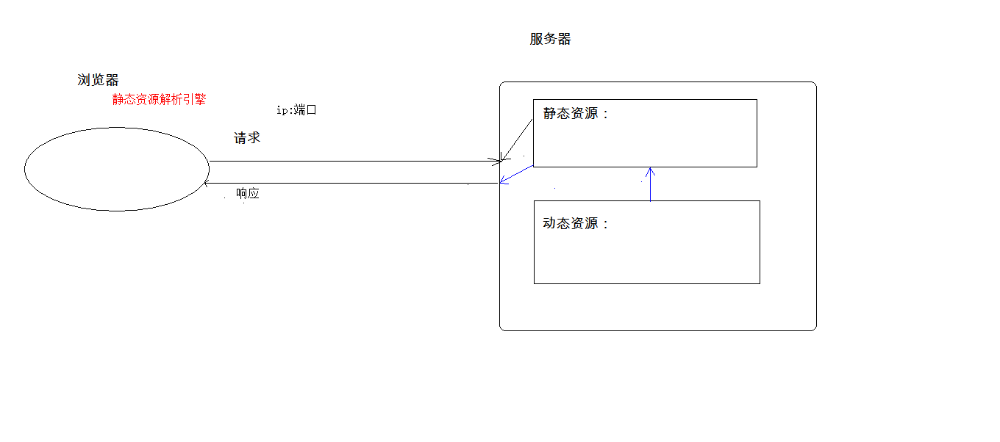
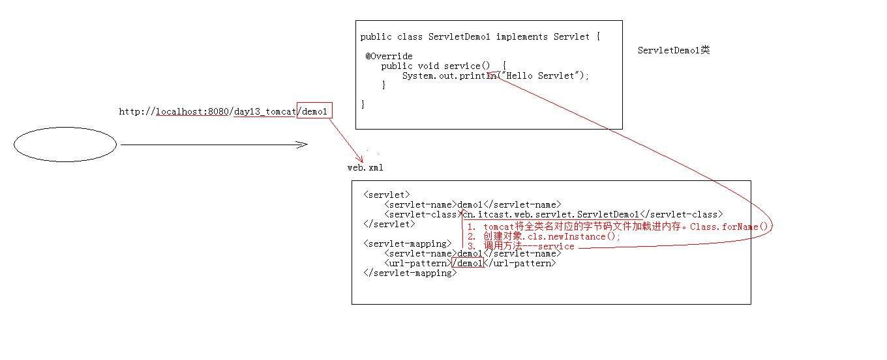

# WEB

## WEB相关概念

1. 软件架构
   - C/S
   - B/S
   
2. 资源分类
  
   
   
   - 静态资源
   - 动态资源（动态资源先转化成静态资源再返回给浏览器）：servlet、jsp
   
3. 网络通信三要素
   - IP
   - 端口
   - 传输协议

## WEB服务器软件

* 服务器：安装了服务器软件的计算机

* 服务器软件：接收用户的请求，处理请求，做出响应

* web服务器软件：接收用户的请求，处理请求，做出响应
	* 在web服务器软件中，可以部署web项目，让用户通过浏览器来访问这些项目
	* web容器
	
* 常见的java相关的web服务器软件：

  * webLogic：oracle公司，大型的JavaEE服务器，支持所有的JavaEE规范，收费的

  * webSphere：IBM公司，大型的JavaEE服务器，支持所有的JavaEE规范，收费的

  * JBOSS：JBOSS公司的，大型的JavaEE服务器，支持所有的JavaEE规范，收费的

  * Tomcat：Apache基金组织，中小型的JavaEE服务器，仅仅支持少量的JavaEE规范servlet/jsp。开源的，免费的

- JavaEE：Java语言在企业级开发中使用的技术规范的总和，一共规定了13项大的规范

- Tomcat：web服务器软件

  1. 下载：http://tomcat.apache.org/

  2. 安装：解压压缩包即可（安装目录建议不要有中文和空格）

  3. 卸载：删除目录

  4. 启动

     1. bin/startup.bat ,双击运行该文件即可

     2. 访问：浏览器输入：http://localhost:8080 回车访问自己； http://别人的ip:8080 访问别人

        > 可能会遇到的问题：
        >
        > 1. 黑窗口一闪而过：
        >    * 原因： 没有正确配置JAVA_HOME环境变量
        >    * 解决方案：正确配置JAVA_HOME环境变量
        >    
        > 2. 启动报错：（查看日志）端口占用
        >
        >    1. 暴力：找到占用的端口号，并且找到对应的进程，杀死该进程（管理员运行CMD)
        >
        >       ```java
        >       netstat -ano|findstr 8080  //查看8080端口占用进程
        >       taskkill -pid 刚才查到的pid -f  //不加f会通知OS结束线程，加f强制结束
        >       ```
        >
        >    2. 温柔：修改自身端口号（不推荐使用）
        >
        >       - 打开tomcat安装目录下的配置文件：conf/server.xml
        >
        >       - 设置
        >
        >         ```xml
        >         <Connector port="8080" protocol="HTTP/1.1"
        >         		               connectionTimeout="20000"
        >         		               redirectPort="8445" />
        >         ```
        >
        >       - 一般会将tomcat的默认端口号修改为80端口，80端口是HTTP协议默认端口。好处就是，在访问时可以不用输入端口号即可访问

  5. 关闭

     1. 正常关闭
        - bin/shutdown.bat
        - ctrl+c
     2. 强制关闭
        - 直接关闭tomcat窗口

  6. 配置（介绍三种在tomcat下部署项目的方式）

     1. 直接将项目放到webapps目录下

        - /hello :项目的访问路径-->虚拟目录
        - 这种方式可以简化一下：将整个项目打包成一个war包，再将war包放置在webapps目录下。（war包将会自动解压缩，同时删除war包，解压缩的文件夹自动会删除）

     2. 配置conf/server.xml文件（配置错误有可能影响其他的程序，不推荐使用）

        在<host>标签体中配置：

        ```xml
        <Context docBase="D:\hello" path="/hehe" />
        //其中
        docBase：项目存放的路径
        path:虚拟目录
        ```

     3. 在conf\Catalina\localhost创建任意名称的xml文件，如hehe.xml(热部署方式)

        在新建的xml文件中写配置：

        ```xml
        <Context docBase="D:\hello" />
        <!-- 这里不能指定path充当虚拟目录，虚拟目录名称是xml文件的名称 -->
        虚拟目录的名称是：xml文件的名称
        ```

- 动态项目的目录结构（对比静态项目的目录结构）

  - 项目根目录
    
    
    
    - WEB-INF目录
      - web.xml :web 项目的核心配置文件
      - classes目录：放置字节码文件的目录
      - lib目录：放置依赖jar包

## IDEA中继承tomcat，创建JavaEE项目，部署项目

> 问题及解决方案：
>
> 1. tomcat log 中文乱码问题；
>
>    - 调整tomcat安装目录下conf/logging.properties中所有encoding为UTF-8
>
>    - IDEA中设置所有编码为UTF-8；help-->Edit Custom VM options，添加：
>
>      `-Dfile.encoding=UTF-8`
>
> 2. Tomcat设置
>
>    - run-->Confriguations-->server-->"Update resources"
>
>      ​											-->Deployment-->Application context:/ 设置虚拟目录
>      
>    - 通过设置run-->Confriguations-->server-->"Update classes and resources" ,再通过debug方式启动可以避免总是重启tomcat。需要注意的是，更改设置之后需要重新启动一次tomcat才会生效。同时，如果新建了Java类，比如servlet，也要重新启动，因为，只是针对与修改，会自动的更新，新建并不会自动更新。
>    
> 3. IDEA会为每一个tomcat部署的项目单独建立一份配置文件，具体配置文件的位置可以通过查看控制台中log获取:
>
>    ​	`Using CATALINA_BASE:   "C:\Users\18395\AppData\Local\JetBrains\IntelliJIdea2020.1\tomcat\Tomcat_8_5_58_JavaWeb"`
>
> 4. 需要区分工作空间目录 和  tomcat部署的web项目 目录
>
>    - tomcat真正访问的是“tomcat部署的web项目”，"tomcat部署的web项目"对应着"工作空间项目" 的web目录下的所有资源
>    - WEB-INF目录下的资源不能被浏览器直接访问
>
> 5. 断点调试

## Servlet

- 概念：运行在服务器端的小程序
  - Servlet是一个接口，定义了Java类被浏览器访问到（被tomcat识别）的规则；
  
  - 定义一个类，实现Servlet接口，复写其中的方法；
  
    > 如果IDEA中新建中没有新建Servlet：项目结构->src设为Source;Facets中一定要勾选SourceRoots
    
    

### Servlet快速入门

1. 创建javaEE项目；

2. 定义一个Java类实现Servlet接口

   ```java
   public class ServletDemo01 implements Servlet{}
   ```

3. 实现接口中的抽象方法

4. 配置Servlet（使用web.xml文件中配置Servlet）

   ```xml
       <!--配置Servlet-->
       <servlet>
           <servlet-name>demo01</servlet-name>
           <!--配置全类名-->
           <servlet-class>Servlet.ServletDemo1</servlet-class>
       </servlet>
   
   	<!--映射-->
       <servlet-mapping>
           <servlet-name>demo01</servlet-name>
           <!--可以重复-->
           <url-pattern>/demo01</url-pattern>
           <url-pattern>/demo111</url-pattern>
       </servlet-mapping>
   ```

   - 执行原理

     

     1. 当服务器接收到客户端浏览器的请求之后，会解析URL路径，获取访问的Servlet的资源路径；
     2. 查找web.xml文件，检索是否具有对应的<url-pattern>标签体内容；若存在，则找到对应的<servlet-class>的全类名；
     3. tomcat将字节码文件加载至内存，并创建对象；
     4. 调用其方法

   - Servlet的生命周期：

     1. 创建:Servlet被创建时会执行init方法，且只执行一次

        - Servlet什么时候会被创建？

          > 1. 默认情况下，Servlet在第一次被访问时由tomcat创建
          >
          > 2. 也可以通过配置确定Servlet的创建时机
          >
          >    ```xml
          >    可以在web.xml配置文件中配置，确定Servlet的创建时间：
          >    	在<servlet>标签下配置：
          >        1. 设置在第一次被访问时创建对象：
          >            <load-on-startup>的值为负数
          >        2. 设置在服务器启动时创建对象:
          >            <load-on-startup>的值为0或正整数
          >    ```

        - 注意：Servlet的实现对象是个单例

          > - 由Servlet中的init方法只被执行一次可以看出，Servlet在内存中只存在一个对象，
          >   即Servlet是单例的。
          >
          > - 多线程访问时，可能存在线程安全问题。
          >
          >   解决方案：
          >
          >   	1. 尽量不要在Servlet中定义成员变量；
          >   
          >    	2. 即使定义了成员变量，也不要修改其值
        
     2. 提供服务：执行service方法，service方法可以被执行多次

        - 每次访问Servlet时，service方法都会调用一次

     3. 销毁：执行destroy方法，只执行一次

        - 只有服务器正常关闭时，才会调用destroy方法；
        - destroy方法在Servlet被销毁前调用，一般用于释放资源

   - Servlet3.0  （支持使用注解方式配置Servlet，可不依赖web.xml配置Servlet）

     - 步骤：
       1. 创建javaEE项目，选择Servlet版本3.0及以上，可以不创建web.xml
       2. 定义类实现Servlet接口；
       3. 复写方法；
       4. 在该类上使用@WebServlet 注解配置Servlet

     > ```java
     > //WebServlet接口的定义及说明
     > @Target({ElementType.TYPE})
     > @Retention(RetentionPolicy.RUNTIME)
     > @Documented
     > public @interface WebServlet {
     >     String name() default "";//相当于xml配置中的<servlet-name>
     > 
     >     String[] value() default {};//表示urlPatterns（）属性配置
     > 
     >     String[] urlPatterns() default {};//<url-pattern>
     > 
     >     int loadOnStartup() default -1;//<load-on-startup>
     > 
     >     WebInitParam[] initParams() default {};
     > 
     >     boolean asyncSupported() default false;
     > 
     >     String smallIcon() default "";
     > 
     >     String largeIcon() default "";
     > 
     >     String description() default "";
     > 
     >     String displayName() default "";
     > }
     > ```

     - 实际写法举例

       ```java
       //三种写法效果一样
       @WebServlet("/annotationServlet")
       @WebServlet(urlPatterns = "/annotationServlet")
       @WebServlet(value = "/annotationServlet")
       ```

       > 注意：
       >
       > - 配置Servlet访问路径时，一个Servlet可以定义多个访问路径。如：
       >
       >   `@WebServlet({"/demo","/demo1","/demo2"})`
       >
       > - 路径定义规则:
       >   - /xxx:路径匹配
       >   - /xxx/xxx；多层路径，目录结构
       >   - *.do;扩展名匹配（自定义扩展名）

   - Servlet体系结构

     Servlet (接口)

     GenericServlet（实现Servlet的抽象类）

     HttpServlet（GenericServlet的子类，抽象类）

     - GenericServlet：将Servlet接口中其他方法做了默认空实现，只将service（）方法作为抽象方法。即定义Servlet类时，可以直接继承GenericServlet，实现service（）方法即可；
     - HttpServlet：对http协议的一种封装，简化操作
       1. 定义类继承HttpServlet
       2. 复写doGet/doPost方法

### ServletContext对象

- 概念：ServletContext对象代表整个web应用，可以和web应用程序的容器（tomcat服务器）通信

- ServletContext对象获取(所获取的对象相同)

  ```java
  //1.通过request对象获取
  request.getServletContext();
  //2.通过HttpServlet获取
  this.getServeltContext();
  ```

- ServletContext对象功能

  1. 获取MIME类型

     - MIME类型:在互联网通信过程中定义的一种文件数据类型（Http亦遵从）

     - 格式：大类型/小类型       如： text/html image/jpeg

     - 获取：String getMimeType(String file) 

       通过扩展名（后缀名）获取。这个方法之所以可以获取到，是因为MIME关系存储在服务器中（<mime-mapping></mime-mapping>），而ServletContext对象可以和web应用程序的容器（tomcat服务器）通信，故可以获取。

  2. 域对象：共享数据

     - **ServletContext对象范围：所有用户所有请求的数据。**

        一般不轻易使用。

     ```java
     1. setAttribute(String name,Object value)
     2. getAttribute(String name)
     3. removeAttribute(String name)
     ```

  3. 获取文件的真实路径（服务器路径、文件部署运行的路径）

     > 方法：
     >
     > ```java
     > //以读取配置文件为例（配置文件一般有三个存放位置：src下、web下、web-->WEB-INF下）
     > //1.获取web目录下的b.txt
     > 	String b = servletContext.getRealPath("/b.txt");
     > 	/* File file = new File(b);//获取到file对象就可以使用输入输出流操作了*/
     > //2.获取web-->WEB-INF目录下的c.txt
     >  String c = servletContext.getRealPath("/WEB-INF/c.txt");
     > //3.获取src下的a.txt 。最后发布时，src中的内容会被发布到 WEB-INF的classes目录下
     > 
     > //Bug提示：src下的文本资源很容易读取不到，特别是复制的，由编码问题的文件。可以重新创建文件，再拷贝。或者，选项目结构，将src设置成资源，再换回src重新部署。再或者，多部署几次。或者src下建一个asserts package/文件夹，选成资源种类，再将文件放进去，这样跟直接放在src下效果一样，打包发布时直接放在classes下。
     > 
     >  //注意：src目录下的资源访问路径，还可以通过ClassLoader获取，但是ClassLoader只能获取src目录下的资源，并不能获取web目录下的资源。局限较大
     >  String a = servletContext.getRealPath("/WEB-INF/classes/a.txt");
     > ```

## Filter

### 1. 概念

   web中的过滤器起到，当访问服务器资源时，过滤器可以拦截请求，完成特定功能；

### 2. 作用

   一般用于完成通用操作，如：登录验证(权限管理)、同一编码处理（特别的，POST请求的请求参数封装在请求体中，需要设置编码）、敏感字符过滤替换

### 3. Filter快速入门

   使用步骤

   > 1. 定义类，实现Filter接口
   > 2. 复写方法（init、doFilter、destroy）
   > 3. 配置拦截拦截路径
   >    - web.xml 方式
   >    - 注解方式

### 4. 过滤器细节

   1. web.xml 配置方式

      ```xml
      <filter>
      	        <filter-name>demo1</filter-name>
      	        <filter-class>cn.itcast.web.filter.FilterDemo1</filter-class>
      </filter>
      
      <filter-mapping>
      	        <filter-name>demo1</filter-name>
      			<!-- 拦截路径 -->
      	        <url-pattern>/*</url-pattern>
      </filter-mapping>
      ```

   2. 过滤器执行流程

      1. 执行过滤器；
      2. 执行放行后的资源；
      3. 执行过滤器剩下的代码

   3. 过滤器的生命周期

      1. init:服务器启动之后创建，会创建Filter对象，然后调用Init方法。init方法只执行一次，一般用于加载资源；
      2. doFilter:每次请求被拦截之后，会执行，可执行多次
      3. destroy:在服务器关闭之后，Filter对象被销毁。如服务器正常关闭，则会执行destroy方法。destroy方法只执行一次，一般用于释放资源。

   4. 过滤器配置详解

      1. 拦截路径配置

         - 具体资源路径：/index.jsp  只有访问index.jsp资源时，过滤器才被执行；
         - 拦截目录：/user/* 访问所有后缀名为jsp资源时，过滤器会被执行；
         - 后缀名拦截：*.jsp 访问所有后缀名为jsp资源时，过滤器都会被执行
         - 拦截所有资源：/* 访问所有资源时，过滤器都会被执行

      2. 拦截方式配置

         1. 注解配置

            1. 设置dispatcherType属性

               - REQUEST:默认值。 浏览器直接请求资源；

               - FORWORD:转发访问资源；

               - INCLUDE:（页面嵌套 时拦截）包含（嵌套）资源时；

                 ```jsp
                 //只要时通过这种方式嵌入的界面，没嵌入一个界面，都会走一次指定的过滤器
                 <jsp:include page = "xxx.jsp"/> 
                 ```

               - ERROR：错误跳转页面（配置errorPage时）

               - ASYNC：异步访问资源时（AJAX）

         2. web.xml配置

            - 设置<dispatcher></dispatcher>标签即可（设置在filter-mapping中，写在url-pattern之后）

              ```xml
              <filter-mapping>
                      <filter-name>demo01</filter-name>
                      <!--拦截路径设置-->
                      <url-pattern>/hello.jsp</url-pattern>
                  	<!--web.xml 配置 拦截方式-->
                      <dispatcher>FORWARD</dispatcher>
              </filter-mapping>
              ```

   5. 过滤器链（配置多个过滤器）

      - 代码执行顺序

        > - 过滤器1
        > - 过滤器2
        > - 放行资源执行
        > - 过滤器2
        > - 过滤器1

      - 多过滤器执行顺序

        1. 过滤器通过注解配置

           类名按照字符串比较规则进行比较，小的先执行

           ```java
           AFilter VS BFilter 
           AFilter先执行
           ```

        2. 过滤器通过web.xml配置

           看<filter-mapping>定义顺序，按顺序执行 

### 5. 案例

   > 1. 登录验证（权限管理）
   > 2. 敏感词汇过滤

### 6. 增强对象的功能（可以通过设计模式解决）

   1. 装饰（者）模式

   2. **代理模式**

         1. 简单了解

            真实对象：被代理的对象

            代理对象

            代理模式：代理对象代理真实对象，达到增强对象功能的目的

         2. 实现方式

            1. 静态代理：存在一个类文件描述代理模式
            2. 动态代理：在内存中形成代理类
               - 实现步骤：
                 1. 代理对象和真实对象实现相投的接口；
                 2. 代理对象 = Proxy.newProxyInstance();
                 3. 使用代理对象调用方法；
                 4. 增强方法；
               - 增强方式：
                 - 增强参数列表
                 - 增强返回值类型
                 - 增强方法体执行逻辑

## Listener

- 监听器为web三大组件之一

- 事件监听机制
  - 事件（如：点击）
  - 事件源（如：按钮）
  - 监听器（一段自定义代码）
  - 注册监听：绑定事件、事件源和监听器

- ServletContextListener监听器：用于监听ServletContext对象的创建和销毁

  - 方法

    ```java
    void contextInitialized(ServletContextEvent sce) //ServletContext对象创建后会调用该方法
    void contextDestroyed(ServletContextEvent sce) //ServletContext对象被销毁之前会调用该方法
    ```

  - 使用步骤

    > 1. 定义类，实现ServletContextListener接口
    >
    > 2. 复写方法
    >
    > 3. 配置
    >
    >    - web.xml方式配置
    >
    >      ```xml
    >      <!--注册监听-->
    >      <listener>
    >          <listener-class>
    >              edu.web.listener.ContextLoaderListener
    >          </listener-class>
    >      </listener>
    >      <!--指定初始化参数,这一部分只要不注释掉，在注解配置的时候依旧可以生效-->
    >      <context-param>
    >              <param-name>contextConfigLocation</param-name>
    >              <param-value>/WEB-INF/classes/applicationContext.xml</param-value>
    >      </context-param>
    >      ```
    >
    >    - 注解配置
    >
    >      ```java
    >      @WebListener
    >      ```
    >
    >      

## HTTP

- 概念：Hyper Text Transfer Protocol 超文本传输协议

  - 传输协议：定义客户端-服务器通信的数据格式
  - 特点
    - 基于TCP/IP协议
    - 默认端口号80
    - 基于请求/响应模型：一次请求对应一次响应
    - **无状态**：每次请求之前相互独立，不能交互数据
  - 历史版本
    - 1.0 ：每次请求响应都会建立新的连接
    - 1.1：复用连接

- 请求消息数据格式

  1. 请求行（请求方式   请求URL  请求协议/版本）

     ​						GET            login.html           HTTP/1.1

     - 请求方式（HTTP协议有7种请求方式，最常见的是GET和POST）

       - GET
         - 请求参数在请求行中，在URL后；
         - 请求的URL长度有限制
         - 相较不太安全
       - POST
         - 请求参数在请求体中
         - 请求的URL长度没有限制
         - 相较安全
     
  2. 请求头（客户端的浏览器告诉服务器一些信息）

       - 格式：请求头名称 ： 请求头值

       - 常见的请求头

         1. User-Agent ：客户端浏览器告诉服务器，所使用的浏览器版本信息；

            > 作用：可在服务器端获取到该头信息，用于解决浏览器的兼容性问题；

         2. Referer：http://localhost/login.html

            Referer头用于告诉服务器，当前请求从何处来

            > 作用：1.防盗链 ；2.做站点统计

  3. 请求空行

    用于分割POST请求的请求头和请求体

  4. 请求体（正文）

    请求体用于封装POST请求消息的请求参数

- 请求消息数据字符串格式

  ```html
  //POST方式（POST请求，请求参数在请求体中）
  //请求行
  POST /AnnotaionServlet/hehe.html HTTP/1.1
  //请求头
  Host: localhost:8080
  User-Agent: Mozilla/5.0 (Windows NT 10.0; Win64; x64; rv:81.0) Gecko/20100101 Firefox/81.0
  Accept: text/html,application/xhtml+xml,application/xml;q=0.9,image/webp,*/*;q=0.8
  Accept-Language: zh-CN,zh;q=0.8,zh-TW;q=0.7,zh-HK;q=0.5,en-US;q=0.3,en;q=0.2
  Accept-Encoding: gzip, deflate
  Content-Type: application/x-www-form-urlencoded
  Content-Length: 18
  Origin: http://localhost:8080
  Connection: keep-alive
  Referer: http://localhost:8080/AnnotaionServlet/login.html
  Upgrade-Insecure-Requests: 1
  //请求空行
  
  //请求体（正文）(未解析时是等号，浏览器解析之后以分号显示)
  username = zhangsan
  ```
  
- 响应消息数据格式

  1. 响应行（协议/版本   响应状态码  状态码描述）
     - 响应状态码：服务器告诉客户端浏览器当次请求和响应的状态（3位数字）
       - 响应状态码分类
         1. 1XX :服务器就收客户端消息，但没有接受完成，等待一段时间后，发送1xx多状态码
         2. 2XX :成功。代表状态码：200
         3. 3XX：重定向。代表状态码：302（重定向），304（访问缓存）
         4. 4XX：客户端错误。代表错误码：404（请求路径没有对应的资源），405（请求方式没有对应的doXXX方法）
         5. 5XX：服务器错误。代表错误码：500（服务器内部出现异常）
  2. 响应头（响应头名称：值）
     - 常见响应头：
       1. Content-Type：服务器告诉客户端本次响应体数据格式以及编码格式
       2.  Content-disposition：服务器告诉客户端以什么格式打开响应体数据（in-line:默认值，在当前页面内打开；attachment;filename=xxx:以附件形式打开响应体。文件下载时会使用）
  3. 响应空行
  4. 响应体

- 响应消息数据字符串格式

  ```html
  HTTP/1.1 200 
  Content-Type: text/html;charset=UTF-8
  Content-Length: 108
  Date: Sat, 10 Oct 2020 12:33:58 GMT
  Keep-Alive: timeout=20
  Connection: keep-alive
  
  <html>
    <head>
      <title>response测试</title>
    </head>
    <body>
    hello ,测试！
    </body>
  </html>
  ```

### Request

#### 1. Request&Response对象

- request和response对象由服务器创建；
- request对象用于获取请求消息，response对象用于设置响应消息；

#### 2. request对象继承体系结构

> ServletRequest		--	接口
> 		|	继承
> HttpServletRequest	-- 接口
> 		|	实现
> org.apache.catalina.connector.RequestFacade 类(tomcat)

#### 3. request功能

##### 1. 获取请求消息数据

1. 获取请求行数据

   - 请求行数据示例：GET /虚拟目录/demo1?name=zhangsan HTTP/1.1

   - 方法

     > - 获取请求方式：GET
     >
     >   `String getMethod()`
     >
     > - **获取虚拟目录：/虚拟目录**
     >
     >   `String getContextPath() //可以有效避免虚拟目录变动导致的访问地址变动问题`
     >
     > - 获取Servlet路径: /demo1
     >
     >   `String getServletPath()`
     >
     > - 获取get方式请求参数:name=zhangsan
     >
     >   `String getQueryString()`
     >
     > - **获取请求URI：/虚拟目录/demo1**
     >
     >   `String getRequestURI():		/day14/demo1`
     >
     >   `StringBuffer getRequestURL()  :http://localhost/虚拟目录/demo1`
     >
     >   注意：
     >
     >   1. URL:统一资源定位符 ： http://localhost/虚拟目录/demo1
     >   2. URI：统一资源标识符 : /虚拟目录/demo1
     >
     > - 获取协议及版本:HTTP/1.1
     >
     >   `String getProtocol()`
     >
     > - 获取客户机IP
     >
     >   `String getRemoteAddr()`

2. 获取请求头数据

   > 方法：
   >
   > - **String getHeader(String name):通过请求头的名称获取请求头的值**
   > - Enumeration<String> getHeaderNames():获取所有的请求头名称

3. 获取请求体数据

   - 请求体：只有POST请求方式才有请求体，在请求体中封装了POST请求的请求参数；

   - 步骤：

     1. 获取流对象

        > 方法
        >
        > - BufferedReader getReader()：获取字符输入流，只能操作字符数据
        > - ServletInputStream getInputStream()：获取字节输入流，可以操作所有类型数据（文件上传中详细说明）

     2. 从流对象中取数据

##### 2. 其他功能

1. 获取请求参数通用方式：GET/POST方式都可以通过下列方法获取请求参数

   > 方法
   >
   > - String getParameter(String name):根据参数名称获取参数值    username=zs&password=123
   > - String[] getParameterValues(String name):根据参数名称获取参数值的数组  hobby=xx&hobby=game（复选框数据处理可使用）
   > - Enumeration<String> getParameterNames():获取所有请求的参数名称
   > - Map<String,String[]> getParameterMap():获取所有参数的map集合
   >
   > 注意：关于中文乱码问题
   >
   > get方式：tomcat 8 已经将get方式的中文乱码问题解决；
   >
   > post方式：会乱码
   >
   > ​						处理方式：在获取参数前设置request的编码：
   >
   > ​                    `request.setCharacterEncoding("utf-8")`		

2. 请求转发：一种**服务器内部**的资源跳转

   >步骤：
   >
   >1. 通过request对象获取请求转发器对象
   >
   >   `RequestDispatcher getRequestDispatcher(String path)`
   >
   >2. 使用RequestDispatcher对象来进行转发
   >
   >   `forward(ServletRequest request, ServletResponse response) `
   >
   >**请求转发特点：**
   >
   >1. 浏览器地址栏路径不会发生变化
   >2. 只能转发到当前服务器内部资源
   >3. 转发是在一次请求中

3. 共享数据

   - 域对象：一个有作用范围的对象，可以在范围内共享数据；

   - request域：代表一次请求的范围，一般用于在**请求转发的多个资源中**共享数据

     > 方法：
     >
     > - void setAttribute(String name,Object obj) ：存储数据
     > - Object getAttitude(String name)：通过键获取值
     > - void removeAttribute(String name)：通过键移除键值对

4. 获取ServletContext

   `ServletContext getServletContext()`

#### 登录案例(requset)

> 用户登录案例需求：
>
> 1. 编写login.html登录页面 username & password 两个输入框
> 2. 使用Druid数据库连接池技术,操作mysql，day14数据库中user表
> 3. 使用JdbcTemplate技术封装JDBC
> 4. 登录成功跳转到SuccessServlet展示：登录成功！用户名,欢迎您
> 5. 登录失败跳转到FailServlet展示：登录失败，用户名或密码错误

```java
//步骤
//1.创建项目，导入html页面，JDBC配置文件，依赖jar包
//2.创建数据库环境
    CREATE	DATABASE USERS;
    USE USERS;
    CREATE TABLE USER(
        id 	INT PRIMARY KEY AUTO_INCREMENT,
        username VARCHAR(32) UNIQUE NOT NULL,
        PASSWORD VARCHAR(32) NOT NULL
    );
//3.创建包domain.User(domain package下创建User)
	- 创建用户实体类，提供set、get方法，重写toString方法
//4.创建包util.JDBCUtils（util package下创建工具类JDBCUtils） 
    - JDBC工具类，使用Durid连接池
    - 加载JDBC配置文件
    - 获取连接池对象
    - 获取连接对象
//5.创建包dao.UserDao(dao package 下创建UserDao，并提供login方法)
    - 声明JdbcTemplate对象，共用
    - login方法体中，编写sql，调用query方法获取查询结果（user对象，可能为null）
//6.创建包web.servlet.LoginServlet(创建web package，其下创建servlet package,在其中创建LoginServlet)
    - 设置编码
    - 获取请求参数
    - 封装user对象
    - 调用UserDao的login方法
    - 通过user值是否为空，判断查询结果。若成功，存储域数据，转发至successServlet；若失败，转发至failServlet
//7.在servlet package 下创建FailServlet和SuccessServlet类
    SuccessServlet：
    - 获取request域中共享的user对象
    - 输出（设置编码，输出）
    FailServlet：
    - 设置编码
    - 输出
//8.login.html中form表单的action路径的写法
    虚拟目录+Servlet的资源路径
//9.BeanUtils工具类的使用：简化数据封装
    用于封装JavaBean的
    - JavaBean：标准的Java类
        1. 要求：
        	1. 类必须被public修饰
            2. 必须提供空参的构造器
            3. 成员变量必须使用private修饰
            4. 提供公共setter和getter方法
        2. 功能：封装数据
    - 概念：
        成员变量 VS 属性
        属性：setter和getter方法截取后的产物。
        如： getUsername() --> Username--> username
    - 方法：
        1. setProperty()
        2. getProperty()
        3. populate(Object obj , Map map):将map集合的键值对信息，封装到对应的JavaBean对象中
```

### Response

#### response功能

##### 1. 设置响应行

- 格式：HTTP/1.1 200 ok
- 设置状态码：setStatus(int sc)

##### 2. 设置响应头

- setHeader(String name,String value)

##### 3. 设置响应体

> 步骤：
>
> 1. 获取输出流
>    - 字符输出流：PrintWriter getWriter()
>    - 字节输出流：ServletOutputStream getOutputStream()
> 2. 使用输出流，将数据输出到客户端浏览器

#### 案例

> 1. 完成重定向（资源跳转）
>
>    ```java
>    //1.设置状态码为302
>    response.setStatus(302);
>    //2.设置响应头location
>    response.setHeader("location","/day15/responseDemo2");
>    
>    //简单的重定向方法（取代1、2两步）
>    response.sendRedirect("/day15/responseDemo2");
>    ```
>
> 2. 服务器输出字符数据到浏览器
>
>    步骤:
>
>    1. 获取字符输出流
>    2. 输出数据
>
>    注意：乱码问题（编解码使用的字符集不一致）
>
>    ```java
>    //PrintWriter 的print方法可以自动刷新，把数据写出缓冲区，这里的PrinterWriter由response对象获取。同理，即使调用write方法，也不需要自己刷新，因为都是由response对象获取的。这里写入普通文本没有问题，写入一些html标签也可以，浏览器可以识别
>    PrintWriter pw = response.getWriter();    //获取的流的默认编码是ISO-8859-1
> //浏览器解析字符集：与当前浏览器所处的操作系统语言环境有关，当前默认GBK（gb2312）
>    //PrintWriter 是由response对象获取的。如果是自己new出来的，那么会和当前的编辑环境编码有关。但获取的流对象实际是tomcat返回的。而tomcat的默认编码是ISO-8859-1，即由response对象获取的流对象的默认编码为tomcat此时的编码格式。
>    
>    正确的写法：
>        方式1. 获取流对象前，设置流的默认编码格式：ISO-8859-1 ---> GBK;但这种方式，不能完全解决。（这只是设置了服务器响应数据的格式，没有固定浏览器的解析格式。如果浏览器恰巧是GBK解码，则不会乱码，若浏览器并非使用GBK解码，依旧会出现乱码现象）
>    		response.setCharacterEncoding("utf-8");
>    	方式2. (设置ContentType响应头)告知浏览器，服务器发送的消息体数据的编码，同时建议浏览器使用该编码进行解码
>            response.setHeader("content-type","text/html;charset=utf-8");
>        方式3.（简单的方式设置ContentType响应头【推荐使用】）
>            response.setContentType("text/html;charset=utf-8");
>    
>    ```
>    
> 3. 服务器输出字节数据到浏览器
>
>    步骤：
>
>     			1. 获取字节输出流
>        			2. 输出数据
>
> 4. 验证码案例（验证码本质：图片；用于防止恶意的表单注册）

> **重定向VS转发**
>
> 1. 重定向：redirect
>    - 重定向地址栏路径变化
>    - 重定向可以访问其他站点（其他服务器）的资源
>    - 重定向是两次请求。不能使用requset对象来共享数据
> 2. 转发：forward
>    - 转发地址栏路径变化
>    - 转发不可以访问其他站点的资源，只能访问当前服务器下的资源
>    - 转发只是一次请求，可以使用request对象来共享数据

> **路径**
>
> 1. 路径分类
>
>    - 相对路径
>    - 绝对路径
>
> 2. 路径写法（通过判断此路径需要给谁使用）
>
>    - 给客户端浏览器使用：需要添加虚拟目录（项目的访问路径）。
>
>      如:<a> , <form> 重定向...;同时，建议动态获取当前的虚拟目录：request.getContextPath()
>
>    - 给服务器使用：不需要添加虚拟目录
>
>      如：转发路径

> **文本下载案例（response+ServletContext）**
>
> * 步骤：
>
>   1. 定义页面，编辑超链接href属性，指向Servlet，传递资源名称filename
>
>   2. 定义Servlet
>
>   3. 获取文件名称
>
>   4. 使用字节输入流加载文件进内存
>
>   5. 指定response的响应头： content-disposition:attachment;filename=xxx
>
>   6. 将数据写出到response输出流
>
> * 中文文件名问题：
>
>   1. 获取客户端使用的浏览器版本信息
>   2. 根据不同的版本信息，设置filename的编码方式不同（使用工具类）

## 会话技术

- 会话
  - 一次会话中包含多次请求和响应；
  - 一次会话：浏览器第一次给服务器资源发送请求，会话建立，直到有一份断开为止
- 功能：在一次会话的范围内的多次请求间**共享数据**
- 方式
  - 客户端会话技术：Cookie
  - 服务器端会话技术：Session

### 1. Cookie

1. 概念：客户端会话技术，将会话数据保存到客户端

2. 快速入门

   > 使用步骤：
   >
   > 1. 创建Cookie对象，绑定数据
   >
   >    ```java
   >    new Cookie(String name,String value)
   >    ```
   >
   > 2. 发送Cookie对象
   >
   >    ```java
   >    response.addCookie(Cookie cookie)
   >    ```
   >
   > 3. 获取Cookie，拿到数据
   >
   >    ```java
   >    Cookie[] request.getCookies();
   >    ```

3. 实现原理

   基于响应头set-cookie 和请求头cookie 实现

   

4. cookie细节

   1. 一次是否可以发送多个cookie？

      >可以。
      >
      >可以创建多个Cookie对象，使用response对象调用多次addCookie方式发送cookie即可实现；

   2. cookie在浏览器中可以保存多长时间？

      > - 默认情况下：当浏览器关闭后，Cookie数据被销毁
      > - 设置（setMaxAge(int seconds)）
      >   - 整数：将Cookie数据写到硬盘中的文件中，持久化存储。并指定cookie存活时间，到达指定时间，cookie文件自动失效；
      >   - 负数：默认值（浏览器关闭后，cookie信息消亡）
      >   - 零：删除cookie信息

   3. cookie能否保存中文？

      > - tomcat 8 版本之前，cookie不能直接存储中文数据。（需要将中文数据进行转码——一般使用URL编码【%E3】）
      >
      > - tomcat 8 版本及以后，cookie支持中文数据。但是特殊字符，如：空格仍然不支持，**建议使用URL编码解码**
      >
      >   ```java
      >   //URL编码
      >   str_date = URLEncoder.encode(str_date,"utf-8");
      >   System.out.println("编码后："+str_date);
      >   
      >   //URL解码：
      >   str_date = URLDecoder.decode(str_date,"utf-8");
      >   System.out.println("解码后："+str_date);
      >   ```
      >
      >   

   4. cookie共享问题？

      > 1. 在一个tomcat服务器中部署了多个web项目，在这些项目中cookie能否共享？
      >
      >    - 默认情况下cookie不能共享；
      >    - 可以通过：setPath(String path)设置cookie的获取范围。默认情况下，设置当前的虚拟目录（如果需要共享，将path设置为”/“）
      >
      > 2. 在不同的tomcat服务器中的cookie共享问题？
      >
      >    - setDomain(String path):如果设置的一级域名相同，那么多个服务器之间的cookie可以共享
      >
      >      ```java 
      >      setDomain(".baidu.com")
      >      那么tieba.baidu.com和news.baidu.com中cookie可以共享
      >      ```

   5. Cookie的特点和作用

      - 特点

        1. cookie存储数据在客户端浏览器

        2. 浏览器对于单个cookie的大小有限制（4KB）以及对于同一域名下的cookie数量也有限制（20个）

      - 作用

        1. cookie一般用于存出少量的不太敏感的数据
        2. 在不登录的情况下，完成服务器对客户端的身份识别

   6. 案例：记住上一次访问时间

      > 1. 需求
      >    1.  访问一个Servlet，如果是第一次访问，则提示：您好，欢迎您首次访问；
      >    2. 如果不是第一次访问，则提示：欢迎回来，您上次访问时间为:显示时间字符串
      > 2. 分析
      >    1. 可以采用Cookie来完成
      >    2. 在服务器中的Servlet判断是否有一个名为lastTime的cookie
      >       - 有：不是第一次访问
      >         1. 响应数据：欢迎回来，您上次访问时间为:2018年6月10日11:50:20
      >         2. 写回Cookie：lastTime=2018年6月10日11:50:01
      >       - 没有：是第一次访问
      >         1. 响应数据：您好，欢迎您首次访问
      >         2. 写回Cookie：lastTime=2018年6月10日11:50:01


### 2. Session

1. 概念：服务器端会话技术，在一次会话的多次请求间共享数据，将数据保存在服务器端的对象中。HttpSession

2. 快速入门

   > 1. 获取HttpSession对象
   >
   >    ```java
   >    HttpSession session = request.getSession();
   >    ```
   >
   > 2. 使用HttpSession对象
   >
   >    ```java
   >    Object getAttribute(String name);
   >    void setAttribute(String name,Object value);
   >    void removeAttribute(String name)
   >    ```

3. 原理

   session 的实现是依赖于Cookie的

   
   
4. 细节

   1. 当客户端关闭，但服务器不关闭，再次获取的session是否为同一个？

      > - 默认情况下，不是同一个session
      >
      > - 若需要在这种情况下保持session相同，可以通过创建Cookie，键为JSESSIONID,设置最大存活时间，使得Cookie得以持久化保存
      >
      >   ```java
      >   Cookie cookie = new Cookie("JSESSIONID",session.getID());
      >   cookie.setMaxAge(60*60);
      >   response.addCookie(cookie);
      >   ```

   2. 当客户端不关闭，但服务器关闭，再次获取的session是否为同一个

      > - 几乎不是同一个（默认情况下，tomcat重新启动建立session存储在随机位置，相同概率很小）
      >
      > - 为保持session数据不丢失，需要在tomcat正常关闭情况下本地持久化（序列化存储）session ,在下次tomcat重新启动时反序列化session本地文件。（tomcat自动完成）
      >
      >   - session的钝化：
      >
      >     服务器正常关闭时，tomcat自动将session对象序列化存储到本地（work目录）
      >
      >   - session的活化：
      >
      >     服务器再次启动时，tomcat将自动对存储的session对象进行反序列化，恢复到tomcat中。
      >
      >   注意：需要在本地tomcat中验证活化。IDEA中钝化没有问题，可以实现序列化到本地。但是从IDEA中的tomcat工作区：Using CATALINA_BASE:   "C:\Users\18395\AppData\Local\JetBrains\IntelliJIdea2020.1\tomcat\Tomcat_8_5_58_JavaWeb_5"前后目录中的work目录。可以看出，当tomcat重新启动时，整个work目录会被整个删除。之前保存的session序列化对象也一同被删除。因此无法实现session的活化。但这一现象在本地的tomcat中并不存在。本地的tomcat中，session序列化对象被成功读取之后才会自动删除。

   3. session 何时被销毁？

      > 1. 服务器关闭
      >
      > 2. session对象调用invalidate（）
      >
      > 3. session默认失效时间 30min（可以手动设置）
      >
      >    ```xml
      >    <session-config>
      >    	<session-timeout>30</session-timeout>
      >    </session-config>
      >    ```

5. session的特点

   1. session用于存储一次会话的多次请求数据，保存在服务器端；
   2. session可以存储任意类型、任意大小的数据

6. session VS cookie

   1. session 存储数据在服务器端，cookie在客户端；
   2. session没有数据大小限制，cookie有大小限制；
   3. session数据安全，cookie相对不安全；

   

## JSP

1. 概念：

   JSP:Java Server Pages Java服务器页面（用于简化书写）

   （一个特殊的页面，其中既可以指定html标签，又可以定义Java代码）

2. 原理：（jsp本质上是一个Servlet）

   

   - 从上图可以看出，若想要查看具体jsp代码对应的Java文件的内容，需要先部署启动服务器，同时进行访问。

3. JSP脚本（JSP定义代码的方式）

   > 1. <%  代码  %>：定义的Java代码（写在servlet方法）。service方法中可以定义什么，这里的“代码”就可以定义什么；
   > 2. <%！ 代码 %>：定义的Java代码，在jsp转化后的Java类的成员位置上。（实际操作时，jsp/servlet中最好不要定义成员变量和成员方法，会引发线程安全问题）
   > 3. <%= 代码 %>：定义的Java代码，会输出到页面上，输出语句中可以定义什么，这里的“代码”就可以定义什么；

4. 指令

   - 作用：用于配置JSP页面，导入资源文件

   - 格式：<%@ 指令名称 属性名1=属性值1 属性名2=属性值2 ...%>

   - 指令分类：

     1. page (用于配置JSP页面)

        > - contentType:等同于response.setContentType()
        >   - 设置响应体的mime类型以及字符集
        >   - 设置当前jsp页面的编码（此项功能需要借助于高级IDE工具完成，在低级IDE中需要手动设置pageEncoding属性，来设置当前页面的编码字符集）
        > - import:导包
        > - errorPage:当前页面发生异常之后，会自动跳转到指定的错误页面（浏览器地址栏不会发生改变）
        > - isErrorPage:标识当前页面是否是错误页面
        >   - true：当前页面是错误页面，可以使用内置对象exception
        >   - false：当前页面不是错误页面，不可以使用内置对象exception

     2. include:页面包含的，需要导入页面的资源文件

        ```jsp
        <%@ include file="top.jsp"%>
        ```

     3. taglib:导入资源

        ```jsp
        <%@ taglib prefix="c" uri="http://java.sun.com/jsp/jstl/core"%>
        // prefix 自定义前缀（一般遵从编码习惯）
        
        注意：
        - 导jar包时注意需要在初始的web目录下创建WEB-INF，再在其下创建lib文件夹存放jar包。并导入Module；（注意WEB-INF的书写）
        - 如果导包发生错误并不能直接进入errorPage页面
        ```

5. 注释

   1. html注释

      ```html
      <!--  -->:只能注释html代码片段(在jsp中使用这种注释，Java代码无法被注释，且注释的内容依旧会被浏览器解析)
      ```

   2. jsp注释（推荐使用）

      ```html
      <%-- --%>:可以注释所有（注释的内容对浏览器不可见）
      ```

      

6. JSP的内置对象（在jsp页面中不需要获取和创建，可以直接使用的对象，jsp一共有9个内置对象）

   - request

   - response

   - out:字符输出流对象，可以将数据输出到页面上（类似于response.getWriter()）

     > out VS response.getWriter
     >
     > - 在tomcat服务器真正给用户响应之前，会先找response缓冲区的数据，再找out缓冲区的数据；
     > - response.getWriter（）数据输出永远在out.write()之前【不论程序的前后顺序】

7. 使用JSP改造Cookie案例


|   变量名    |      真实类型       |                      作用                      |
| :---------: | :-----------------: | :--------------------------------------------: |
| pageContext |     PageContext     | 当前页面共享数据（还可以获取其他八个内置对象） |
|   request   | HttpServletRequset  |         一次请求访问的多个资源（转发）         |
|   session   |     HttpSession     |              一次会话的多个请求间              |
| application |   ServletContext    |               所有用户间共享数据               |
|  response   | HttpServletResponse |                    响应对象                    |
|    page     |       Object        |       当前页面（Servlet）的对象    this        |
|     out     |      JspWriter      |           输出对象，数据输出到页面上           |
|   config    |    ServletConfig    |               Servlet的配置对象                |
|  exception  |      Throwable      |                    异常对象                    |

## MVC开发模式


1. jsp演变历史

   > - 早期只用servlet，只能使用response输出标签数据，十分麻烦；
   > - 后来使用jsp简化Servlet的开发，但过度使用jsp，jsp中会存在大量的Java代码，维护困难，不利于分工；
   > - 再后来，Javaweb的开发借鉴MVC开发模式，使得程序设计更加合理

2. MVC

   1. M: Model 模型（JavaBean）：用以完成具体的业务操作，如:查询数据库，封装对象
   2. V：View  视图（JSP）：用以展示数据
   3. C ：Controller  控制器（Servlet）:用以获取用户输入；调用模型；将数据交给视图进行展示；

   > MVC 具有低耦合，方便维护，利于分工；重用性高
   >
   > 同时，也会使项目变得复杂，对开发人员的要求提高

## 三层架构：软件设计架构


1. 界面层（表示层）：用户看到的界面。用户可以通过界面上的组件和服务器进行交互
2. 业务逻辑层：处理业务逻辑
3. 数据访问层：操作数据存储文件


## EL表达式

1. EL: Expression Language 表达式语言

2. 作用：替换和简化jsp页面中Java语言的编写

3. 语法：${表达式}

   > JSP默认支持EL表达式，如果需要忽略EL表达式可以使用：（忽略后，EL表达式以文本显示，不运算）
   >
   > 1. 设置JSP中的page指令。 设置isELIgnored="true" 忽略当前jsp页面中所有的EL表达式
   > 2. \${ 表达式 } ： 忽略当前的EL表达式

4. 使用

   1. 运算

      - 运算符：

        > 1. 算数运算符： + - * /(div) %(mod)
        >
        > 2. 比较运算符： > < >= <= == !=
        >
        > 3. 逻辑运算符： &&(and) ||(or) !(not)
        >
        > 4. 空运算符： empty
        >
        >    - 空运算符功能：用于判断字符串、集合、数组对象是否为null或者长度是否为0
        >
        >      ```js
        >      ${empty list}:判断字符串、集合、数组对象是否是null或者长度为0；
        >      ${not empty str}:表示判断字符串、集合、数组对象是否不为null 并且 长度大于0；
        >      ```
      
   2. 获取值

      1. EL表达式只能从域对象中获取值

      2. 语法：

         - ${ 域名称.键名}：从指定域中获取指定键的值；

           |      域名称      |                             |
           | :--------------: | :-------------------------: |
           |    pageScope     |         pageContext         |
           |   requestScope   |           request           |
           |   sessionScope   |           session           |
           | applicationScope | application(ServletContext) |

           ```js
           //如：在requset中存储 name="zhangsan"
           //获取：
           ${requestScope.name}
           ```

         - ${ 键名 }：依次从最小的域中查找是否具有该键对应的值，直到找到为止

      3. 获取对象、List集合、Map集合的值

         1. 获取对象的值：${ 域名称.键名.属性名}

            本质上，会去调用对象的getter方法

         2. 获取List集合的值：${域名称.键名【索引】}

         3. 获取Map集合：

            ${域名称.键名.key名称}

            ${域名称.键名["key名称"]}

      4. 隐式对象

         - EL表达式有11个隐式对象

         - pageContext(可用于获取jsp的其他八个内置对象)

           ```js
           ${pageContext.request.contextPath}:动态获取虚拟目录
           ```

## JSTL

1. 概念：Java Server Pages Tag Library JSP标准标签库

   - 由Apache组织提供的开源的免费jsp标签   <标签>

2. 作用：用于简化和替换JSP页面上的Java代码

3. 使用步骤：

   1. 导入JSTL相关jar包
   2. 引入标签库：taglib指令  <%@ taglib%>
   3. 使用标签

4. 常用的JSTL标签

   1. if :相当于Java代码中的if语句

      > 1. 属性
      >    - test 属性——必须属性，接受Boolean表达式。如果表达式为true，只显示if标签体内容，如果为false，则不显示标签体内容。
      >    - 一般情况下，test属性值会结合EL表达式一起使用
      > 2. 注意：prefix: if 标签没有else ，如果想实现else功能，需要再定义一个prefix:if标签

   2. choose：相当于Java代码中的switch语句

      > 1. 使用choose标签声明          相当于switch声明
      > 2. 使用when标签做判断         相当于case
      > 3. 使用otherwise标签做其他情况的声明            相当于default

   3. foreach：相当于Java代码中的for语句

      相当于Java的for语句

5. 案例

   > 1. JSTL练习：在request域中有一个User对象的List集合。需要使用JSTL+EL将List集合数据暂时到JSP页面的table表格中。
   >2. 阶段性练习（登录+CRUD显示）【day17Exercise】


## Maven

1. 概念

2. 核心功能
   - 依赖管理：maven工程对jar包的管理（提高代码重用，之前jar包在本地，maven工程jar包在maven仓库）；
   - 一键构建

3. 仓库种类和彼此关系

   

   - 仓库分类
     - 本地仓库（开始在系统盘，可以在conf/setting.xml中配置自定义路径）
     - 远程仓库（私服）
     - 中央仓库

4. maven标准目录结构

   > 一般（JavaSE）项目：
   >
   > ​		核心代码部分；
   >
   > ​		配置文件部分；
   >
   > ​		测试代码部分；
   >
   > ​		测试配置文件；
   >
   > 一般项目结构：
   >
   > ```java
   > 项目名
   >     	src
   > //虽然可以建立一些其他的诸如，config、resources等目录，但不统一，每个人做的可能都不同
   > ```
   >
   > maven项目标准目录结构：（JavaSE）
   >
   > ```java
   > 项目名
   >     src/main/java目录 核心代码部分；
   >     src/main/resources 配置文件部分；
   >     src/test/java目录 测试代码部分；
   >     src/test/resources 测试配置文件部分；
   >     //对于JavaWEB项目
   >     src/main/webapp 页面资源，js,css,图片等
   >  
   > ```
   >
   > 

   

